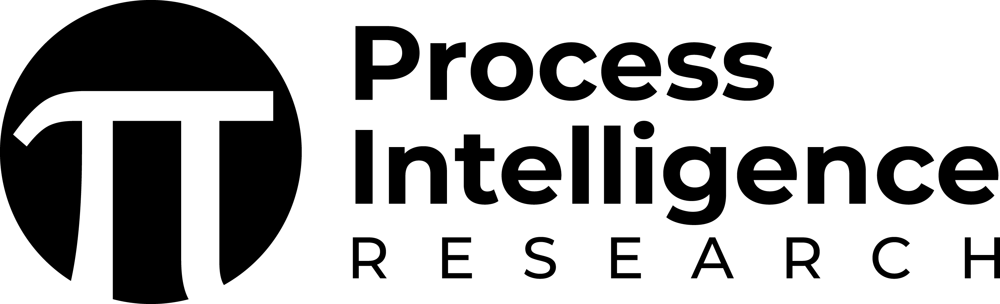
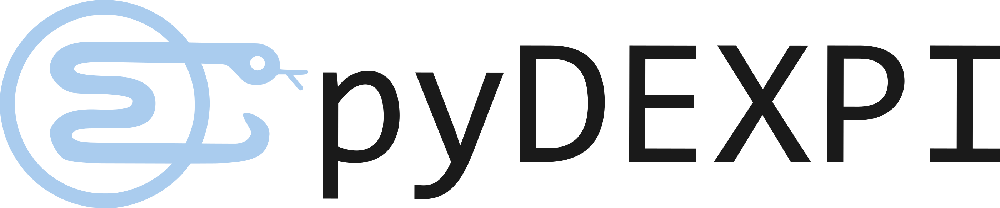
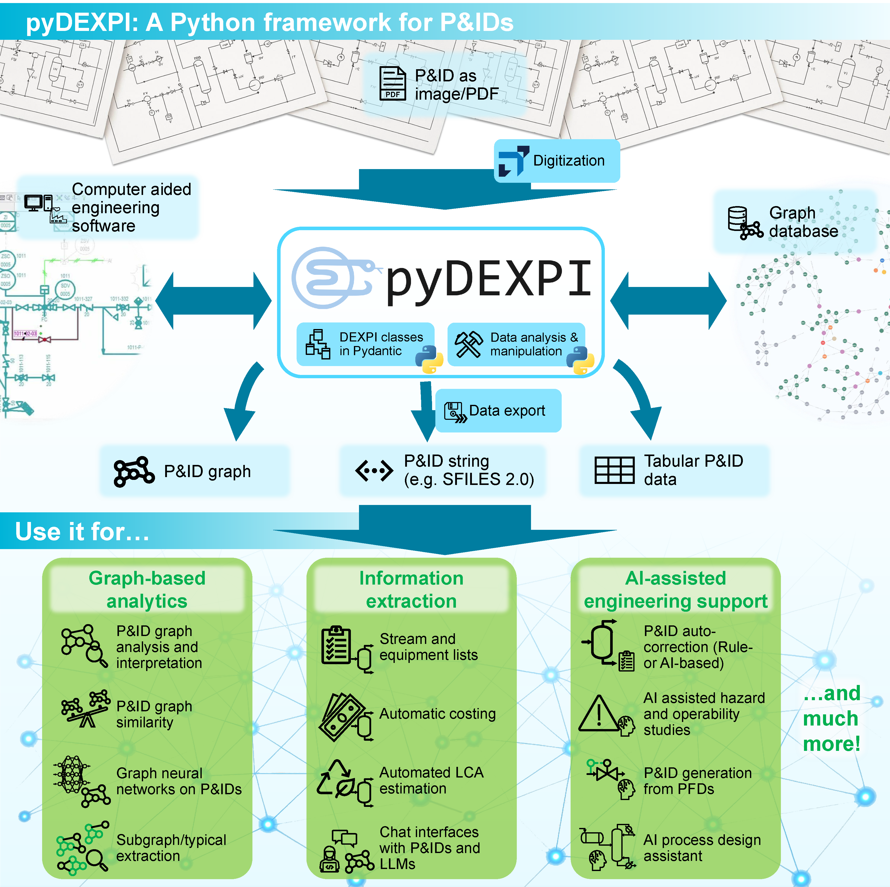

<!-- omit from toc -->
# pyDEXPI by [](https://www.pi-research.org/)


<p align="center">
    
</p>

## Overview

Smart, machine-readable Piping and Instrumentation Diagram (P&ID) data is key to unlocking innovation in the process industry, especially for emerging applications like Generative Artificial Intelligence (GenAI) - [see examples of GenAI for the process industry](https://www.pi-research.org/research/research_projects/). pyDEXPI helps enable this by making the DEXPI standard accessible and usable in Python.

pyDEXPI is an open-source tool in Python that implements the [**DEXPI**](https://dexpi.org/) **data model**. Importantly, pyDEXPI includes a [**Pydantic**](https://docs.pydantic.dev/) data class model of the [DEXPI data model](https://dexpi.plants-and-bytes.de/). This allows building Python applications with the DEXPI standard. pyDEXPI further provides functions to load a Proteus .xml export of DEXPI, the current DEXPI exchange format, into the data model.

pyDEXPI implements a parser to a **graph representation** of Piping and Instrumentation Diagrams (P&IDs) using [NetworkX](https://networkx.org/). This allows the user to work easily with the graph data.

Supports DEXPI version 1.3.


<p align="center">
    
</p>


### Features
- **DEXPI data model** as [Pydantic](https://docs.pydantic.dev/) classes in Python.
- **Load Proteus .xml** files to a pyDEXPI instance.
- **pyDEXPI toolkit** to analyze and manipulate pyDEXPI models.
- **Parse pyDEXPI instance to graph** in [NetworkX](https://networkx.org/).
- **Synthetic DEXPI P&ID generation** for generative Artificial Intelligence (AI).


### Citation
Please reference this software package as:
```
@InProceedings{pyDEXPI,
  author    = {Goldstein, Dominik P. and Schulze Balhorn, Lukas and Alimin, Achmad Anggawirya and Schweidtmann, Artur M.},
  booktitle = {Proceedings of the 35th European Symposium on Computer Aided Process Engineering (ESCAPE35)},
  title     = {pyDEXPI:{A} {Python} framework for piping and instrumentation diagrams using the {DEXPI} information model},
  year      = {2025},
  address   = {Ghent, Belgium},
  month     = {July},
  doi       = {https://doi.org/10.69997/sct.139043},
}
```

## Table of contents

- [Overview](#overview)
  - [Features](#features)
  - [Citation](#citation)
- [Table of contents](#table-of-contents)
- [Installation](#installation)
- [Using pyDEXPI](#using-pydexpi)
  - [pyDEXPI Python model](#pydexpi-python-model)
  - [Proteus import](#proteus-import)
  - [Serialization](#serialization)
  - [Graph export](#graph-export)
  - [Synthetic P\&ID generation](#synthetic-pid-generation)
- [Relevant applications and references](#relevant-applications-and-references)
- [Contributors](#contributors)
- [Copyright and license](#copyright-and-license)
- [Contact](#contact)


## Installation

Install the pyDEXPI package via 
```bash
pip install pydexpi
```
or from GitHub via:
```bash
pip install git+https://github.com/process-intelligence-research/pyDEXPI
```

Alternatively, get the latest updates by cloning the repo and installing the editable version of the package with:

```bash
git clone https://github.com/process-intelligence-research/pyDEXPI
cd pyDEXPI
pip install .
```

## Using pyDEXPI

The following section serves as a first guide to start using the package, illustrated with the [DEXPI reference P&ID](https://gitlab.com/dexpi/TrainingTestCases/-/tree/master/dexpi%201.3/example%20pids/C01%20DEXPI%20Reference%20P&ID?ref_type=heads) (`data/C01V04-VER.EX01.xml` &copy; DEXPI e.V.). We recommend to study the [DEXPI data model](https://dexpi.plants-and-bytes.de/) before working with the tool. 
For more details, see the [extended documentation](https://pydexpi.readthedocs.io/en/latest/).

### pyDEXPI Python model

The [pyDEXPI Python model](pydexpi/dexpi_classes/) is derived from the [DEXPI data model](https://dexpi.plants-and-bytes.de/) and implemented using [Pydantic](https://docs.pydantic.dev/). By using Pydantic the rules of the data model are automatically enforced, for instance, a pump cannot be added as a nozzle to a tank. Each DEXPI instance gets assigned an ID in the form of an uuid, if not specified differently by the user.

The following DEXPI data types are replaced with default Python classes:
-  "String", "NullableString", "AnyURI", "NullableAnyURI" -> "str"
-  "Integer", "NullableInteger", "UnsignedByte" -> "int"
-  "Double" -> "float"
-  "DateTime", "NullableDateTime" -> "datetime"

### Proteus import

The [Proteus serializer](pydexpi/loaders/proteus_serializer.py) loads a proteus .xml file to a DEXPI model. Drawing information are currently not parsed, among others.

```python
from pydexpi.loaders import ProteusSerializer

directory_path = "data"
filename = "C01V04-VER.EX01.xml"
my_loader = ProteusSerializer()
dexpi_model = my_loader.load(directory_path, filename)
```

### Serialization

You can load and save DEXPI Python models via the [serializer](pydexpi/loaders/serializer.py). Currently pickle `.pkl` and json `.json` are offered as file formats.

For json:

```python
from pydexpi.loaders import JsonSerializer

my_serializer = JsonSerializer()
```

For pickle:

```python
from pydexpi.loaders import PickleSerializer

my_serializer = PickleSerializer()
```

Then:

```python
my_serializer.save(dummy_dexpi_model, "dummy_path", "dummy_filename")
dummy_dexpi_model = my_serializer.load("dummy_path", "dummy_filename")
```

### Graph export

The [graph loader](pydexpi/loaders/graph_loader.py) exports a DEXPI model to a [NetworkX](https://networkx.org/) graph. This is implemented as an abstract class to accommodate customized graph formats. The package includes an implementation for direct application [MLGraphLoader](pydexpi/loaders/ml_graph_loader.py). Here, we represent DEXPI components such as tagged plant equipment, process instrumentation functions, and piping components as nodes. The connectivity between the nodes represent piping connections or signal connections as directed edges. Data attributes of the pyDEXPI classes are added as node/edge attributes of the respective, representing node.

```python
from pydexpi.loaders.ml_graph_loader import MLGraphLoader
from pydexpi.loaders import ProteusSerializer

directory_path = "data"
filename = "C01V04-VER.EX01.xml"
# load proteus
my_loader = ProteusSerializer()
dexpi_model = my_loader.load(directory_path, filename)
# export to graph
my_graph_loader = MLGraphLoader(plant_model=dexpi_model)
my_graph_loader.parse_dexpi_to_graph()
my_graph_loader.draw_process_matplotlib()
```

### Synthetic P&ID generation

The [synthetic data generation](pydexpi/syndata/) generation contains code for the creation of synthetic P&IDs. This method is based on the aggregation of P&ID module templates (or patterns) as described in the publication [Toward automatic generation of control structures for process flow diagrams with large language models](https://doi.org/10.1002/aic.18259). An abstraction of the generation logic allows to customize the procedure underlying the module aggregation. For this, the abstract [GeneratorFunction](pydexpi/syndata/generator_function.py) can be implemented as required. An example implementation [RandomGeneratorFunction](pydexpi/syndata/generator_function.py) is provided. This implementation selects P&ID modules at random. P&ID modules can be used in any data representation. For this, suitable abstractions of the [Pattern Class](pydexpi/syndata/pattern.py) and the [Connector Class](pydexpi/syndata/pattern.py) need to be implemented. A pattern wraps a P&ID data structure for the generation algorithm. A connector acts as a connection interface of a P&ID module. Sample implementations of patterns and connectors are provided for [pyDEXPI instances](pydexpi/syndata/dexpi_pattern.py)  and [NetworkX graphs](pydexpi/syndata/graph_pattern.py). A UML diagram of the implementation is given [here](docs/GeneratorUML.pdf). 

The code below demonstrates the synthetic data generation algorithm with the RandomGeneratorFunction and the pyDEXPI/Graph patterns.

```python
import os
from pydexpi.syndata import SyntheticPIDGenerator, PatternDistribution
from pydexpi.syndata.generator_function import RandomGeneratorFunction

# Load distributions
the_path = "./data/dexpi_sample_patterns"
# the_path = "./data/graph_sample_patterns" # Alternatively for graph patterns
pattern_distr_names = [name for name in os.listdir(the_path) if os.path.isdir(os.path.join(the_path, name))]
distributions = [PatternDistribution.load(the_path, name) for name in pattern_distr_names]
distribution_dict = {distribution.name: distribution for distribution in distributions}

generator_function = RandomGeneratorFunction(distribution_range=distribution_dict)
the_generator = SyntheticPIDGenerator(generator_function, max_steps=5)
syn_pattern = the_generator.generate_pattern("New pattern label")
```

## Relevant applications and references

**Vision of GenAI for process engineering**
- Schweidtmann, A. M. (2024). Generative artificial intelligence in chemical engineering. Nature Chemical Engineering, 1(3), 193-193. [https://doi.org/10.1038/s44286-024-00041-5](https://doi.org/10.1038/s44286-024-00041-5)

**Chat interface for P&IDs using Large Language Models (LLMs)**
- Alimin, A. A., Goldstein, D. P., Balhorn, L. S., & Schweidtmann, A. M. (2025). Talking like piping and instrumentation diagrams (p&ids). Proceedings of the 35th European Symposium on Computer Aided Process Engineering (ESCAPE35), Ghent, Belgium. [https://doi.org/10.69997/sct.159477](https://doi.org/10.69997/sct.159477)

**Error correction of P&IDs**
- Balhorn, L. S., Seijsener, N., Dao, K., Kim, M., Goldstein, D. P., Driessen, G. H., & Schweidtmann, A. M. (2025). Rule-based autocorrection of Piping and Instrumentation Diagrams (P&IDs) on graphs. Proceedings of the 35th European Symposium on Computer Aided Process Engineering (ESCAPE35), Ghent, Belgium. [https://doi.org/10.69997/sct.150968](https://doi.org/10.69997/sct.150968)
- Balhorn, L. S., Caballero, M., & Schweidtmann, A. M. (2024). Toward autocorrection of chemical process flowsheets using large language models. In Computer Aided Chemical Engineering (Vol. 53, pp. 3109-3114). Elsevier. [https://doi.org/10.1016/B978-0-443-28824-1.50519-6](https://doi.org/10.1016/B978-0-443-28824-1.50519-6)


**Process development**
- Vogel, G., Balhorn, L. S., & Schweidtmann, A. M. (2023). Learning from flowsheets: A generative transformer model for autocompletion of flowsheets. Computers & Chemical Engineering, 171, 108162. [https://doi.org/10.1016/j.compchemeng.2023.108162](https://doi.org/10.1016/j.compchemeng.2023.108162)
- Balhorn, L. S., Hirtreiter, E., Luderer, L., & Schweidtmann, A. M. (2023). Data augmentation for machine learning of chemical process flowsheets. In Computer Aided Chemical Engineering (Vol. 52, pp. 2011-2016). Elsevier. [https://doi.org/10.1016/B978-0-443-15274-0.50320-6](https://doi.org/10.1016/B978-0-443-15274-0.50320-6)
- Hirtreiter, E., Schulze Balhorn, L., & Schweidtmann, A. M. (2024). Toward automatic generation of control structures for process flow diagrams with large language models. AIChE Journal, 70(1), e18259. [https://doi.org/10.1002/aic.18259](https://doi.org/10.1002/aic.18259)
- Balhorn, L. S., Degens, K., & Schweidtmann, A. M. (2025). Graph-to-SFILES: Control structure prediction from process topologies using generative artificial intelligence. Computers & Chemical Engineering, 109121. [https://doi.org/10.1016/j.compchemeng.2025.109121](https://doi.org/10.1016/j.compchemeng.2025.109121)

**Digitization of paper P&IDs to smartP&IDs**
- Theisen, M. F., Flores, K. N., Balhorn, L. S., & Schweidtmann, A. M. (2023). Digitization of chemical process flow diagrams using deep convolutional neural networks. Digital chemical engineering, 6, 100072. [https://doi.org/10.1016/j.dche.2022.100072](https://doi.org/10.1016/j.dche.2022.100072)
- [Digitization Companion](https://www.digitization-companion.com/)


## Contributors

| | | |
| --- | --- | --- |
|  | [Dominik P. Goldstein](https://www.pi-research.org/author/dominik-goldstein/) | <a href="https://www.linkedin.com/in/dominik-goldstein-9a669324b/" rel="nofollow noreferrer">   </a> <a href="https://scholar.google.com/citations?user=4s7fSyIAAAAJ&hl=en" rel="nofollow noreferrer">   </a> |
|  | [Lukas Schulze Balhorn](https://www.pi-research.org/author/lukas-schulze-balhorn/) | <a href="https://www.linkedin.com/in/lukas-schulze-balhorn-12a3a4205/" rel="nofollow noreferrer">   </a> <a href="https://scholar.google.com/citations?user=LZZ7piQAAAAJ&hl=en" rel="nofollow noreferrer">   </a> |
|  | [Achmad Anggawirya Alimin](https://www.pi-research.org/author/achmad-a.-alimin/) | <a href="https://www.linkedin.com/in/anggawirya/" rel="nofollow noreferrer">   </a> <a href="https://scholar.google.com/citations?user=zO7yftgAAAAJ&hl=en" rel="nofollow noreferrer">   </a> |
|  | [Artur M. Schweidtmann](https://www.pi-research.org/author/artur-schweidtmann/) | <a href="https://www.linkedin.com/in/schweidtmann/" rel="nofollow noreferrer">   </a> <a href="https://scholar.google.com/citations?user=g-GwouoAAAAJ&hl=en" rel="nofollow noreferrer">   </a> |

## Copyright and license

This software is released under the [OSI-approved](https://opensource.org/license) **GNU Affero General Public License (AGPL-3.0) license**  (see [license file](LICENSE) file for details). We believe in open collaboration and knowledge sharing, and encourage use by **students, researchers, open-source contributors, and industry**. You are free to use, modify, and distribute the software under the given license terms. This is a copyleft license, which means that any software based on pyDEXPI, or any modified version thereof, must be published under the same open-source license.

**Commercial or Proprietary Use?**

If you would like to:
- Use this software in a proprietary or closed-source product,
- Use it in a way that is not compatible with AGPL copyleft obligations, or
- Obtain dedicated support or feature extensions,

We’re happy to discuss a commercial or custom license on a case-by-case basis.  
Please reach out to [a.schweidtmann@tudelft.nl](a.schweidtmann@tudelft.nl) for more information.

Copyright (C) 2025 Artur Schweidtmann. 

## Contact

<!-- omit from toc -->
### Artur Schweidtmann

📧 [Contact](mailto:a.schweidtmann@tudelft.nl)

<p align="left">
<a href="https://twitter.com/ASchweidtmann" target="blank"></a>
</p>

<p align="left">
<a href="https://www.linkedin.com/in/schweidtmann/" target="blank"></a>
</p>

<!-- omit from toc -->
### Process Intelligence Research Group

🌐 [PI research](https://pi-research.org)

<p align="left">
<a href="https://www.linkedin.com/company/84022065" target="blank"></a>
</p>
